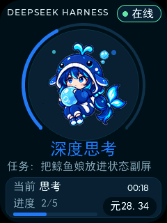
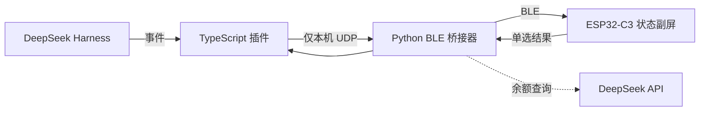

<div align="center">

# 🐋 Harness Whale Companion

**把 DeepSeek Harness 的运行状态装进一块会动的 ESP32-C3 小副屏**

个人 Demo · BLE 直连 · 无需局域网 · 可在设备上完成简单单选

[](https://github.com/1ikeMcFlurry/harness-whale-companion/releases/latest)
[](#电脑端要求)
[](#从源码构建固件)
[](#项目定位)




</div>

## 项目定位

这是一个个人制作的硬件 Demo（概念验证），用来展示“AI Agent 状态副屏”这一玩法。它适合学习、复现、改造和社区交流，目前不是一套面向量产或长期运维的完整产品。

固件会把硬件变成 Harness 专用状态屏，只保留本 Demo 所需的界面与交互。源码树仍包含开发板原工程的部分板级支持模块，以保证固件可以完整构建；运行时入口由 `PRODUCT_HARNESS_ONLY=1` 限制为 Harness 模式。

## 它能做什么

- 显示当前状态：离线、待命、思考、执行工具、等待、等待选择、完成、错误、已停止。
- 显示当前任务标题、持续时间、Todo 进度和工具类型。
- 显示 DeepSeek API 余额；任务结束后立即刷新，并在 3 秒、10 秒、30 秒补拉，另有 5 分钟兜底刷新。
- 金额过长时循环滚动显示，人民币格式为 `123.45元`。
- 用不同的 Q 萌慵懒鲸鱼娘动效表达不同状态。
- 普通单选题可直接在设备上用上/下/确认三键回答。
- 插件内可用 `/whale` 查看桥接器与硬件连接状态。
- 电脑和设备通过 BLE 连接，不要求同一 Wi-Fi，也不依赖 2.4 GHz 网络。

## 为什么仍然需要桥接器

需要，但用户不用手动启动它。

DeepSeek Harness 运行在电脑上，ESP32-C3 设备通过 BLE 接收数据；两端不能直接调用彼此的运行时 API。仓库中的 Python 桥接器负责把本机插件事件转换成紧凑 BLE 数据帧，并把设备按键选择送回插件。安装完成后，Harness 插件会自动启动和管理桥接器。



插件不会把 Prompt、模型回答、文件内容、工具参数或 API Key 发给设备。详见 [架构说明](docs/ARCHITECTURE.md) 与 [BLE 协议](docs/PROTOCOL.md)。

## 硬件要求

当前已测试配置：

| 部件 | 要求 |
|---|---|
| 主控 | ESP32-C3，8 MB Flash |
| 屏幕 | ST7789P3，240 × 320 |
| 按键 | 3 个 ADC 按键：上 / 下 / 确认 |
| 连接 | BLE |

这份固件包含特定开发板的屏幕、按键、电源和分区配置，并不是任意 ESP32-C3 开发板都能直接烧录。使用其他板子时，请先修改 [`board_config.h`](device-firmware/components/platform/platform_esp32/include/platform/board_config.h) 和显示驱动配置，再自行构建。

## 电脑端要求

- Windows 10/11 64 位（当前一键安装流程的实测平台）。
- Python 3.10～3.13，安装时勾选 **Add Python to PATH**。
- 电脑有可用蓝牙，并已安装 DeepSeek Harness。
- 烧录固件时使用可传输数据的 USB 线。

## 最快安装方式

### 1. 下载代码与固件

先克隆仓库，或使用 GitHub 的 **Code → Download ZIP** 下载代码：

```powershell
git clone https://github.com/1ikeMcFlurry/harness-whale-companion.git
cd harness-whale-companion
```

再从 [Releases](https://github.com/1ikeMcFlurry/harness-whale-companion/releases/latest) 下载唯一的固件文件 `Harness-Whale-ESP32C3-8MB.bin`，放到 `installer\firmware\`。校验清单已经包含在代码仓库中。

### 2. 安装 Harness Companion

在仓库根目录打开 PowerShell：

```powershell
python installer\install_companion.py
```

安装器会：

1. 把插件安装到 `~/.dsh/plugins/harness-whale-companion/`；
2. 把桥接器安装到 `~/.dsh/harness-whale-bridge/`；
3. 创建独立 Python 虚拟环境并安装 BLE 依赖；
4. 自动更新 Harness 的 `cordis.patch.yml`；
5. 静默询问 DeepSeek API Key，用于余额显示。

API Key 可以直接回车跳过；跳过后其余状态功能仍可使用，设备余额显示为 `--`。不要把 Key 放进命令行、截图、Issue 或 Git 提交。

安装后完全退出并重新启动 Harness。输入 `/whale` 可以查看桥接器和设备连接状态。

### 3. 烧录固件

烧录会整片擦除设备上的旧固件、NVS、配置和存档，请先确认设备允许被覆盖。

```powershell
python -m venv .flash-venv
.\.flash-venv\Scripts\python.exe -m pip install -r installer\requirements-flash.txt
.\.flash-venv\Scripts\python.exe installer\flash_firmware.py
```

脚本会自动识别串口、校验 SHA-256、擦除 Flash，并把完整镜像从 `0x0` 写入。烧录后 BLE 名称为 `HARNESS-WHALE`。

## 设备上的单选交互

当 Harness 请求普通单选时：

- 上键 / 下键：切换选项；
- 确认键：提交当前选项；
- 2～4 个选项：一页显示；
- 5 个及以上：每页显示 3 个实际选项和 1 个翻页项。

为了保持小屏交互简单，多选、自由文本和复杂的“其他”补充仍回到电脑完成。电脑与设备同时等待时，任意一端先回答，另一端会自动取消，避免重复提交。

## 自定义固件路径

若不想把 `.bin` 放到 `installer\firmware\`，请把 `installer\firmware\manifest.json` 复制到 `.bin` 同一目录，再显式指定固件：

```powershell
python -m venv .flash-venv
.\.flash-venv\Scripts\python.exe -m pip install -r installer\requirements-flash.txt
.\.flash-venv\Scripts\python.exe installer\flash_firmware.py --firmware D:\path\to\Harness-Whale-ESP32C3-8MB.bin
```

## 从源码构建固件

安装 ESP-IDF 5.5，并进入已激活 ESP-IDF 环境：

```powershell
cd device-firmware
idf.py set-target esp32c3
idf.py build
python scripts\release.py
```

主要入口：

- 专用运行时：`device-firmware/components/app/src/app.c`
- Harness UI：`device-firmware/components/ui/presentation/src/ui_harness.c`
- 状态协议解析：`device-firmware/components/core/services/src/harness_status.c`
- BLE GATT：`device-firmware/components/platform/platform_esp32/src/ble_config.c`
- 板级引脚：`device-firmware/components/platform/platform_esp32/include/platform/board_config.h`

## 交给豆包或其他 AI 自动部署

仓库根目录的 [`AGENTS.md`](AGENTS.md) 和 [`docs/AI_DEPLOYMENT.md`](docs/AI_DEPLOYMENT.md) 是机器可读的确定性操作说明。可以把下面这段话直接交给能够操作本机终端的 AI：

> 请先完整阅读 AGENTS.md 和 docs/AI_DEPLOYMENT.md，然后从这个代码仓库部署 Harness Whale Companion，并从 Release 下载唯一的 .bin 固件。先做只读环境检查，再运行源码安装器；API Key 必须由我在终端中静默输入，禁止输出、记录或写入脚本。烧录前必须确认串口和整片擦除范围，只烧录目标 ESP32-C3，不要修改其他 Harness 插件。

## 项目目录

| 路径 | 内容 |
|---|---|
| `device-firmware/` | ESP-IDF 固件源码、UI、字库、鲸鱼娘资源 |
| `harness/plugin/` | Harness TypeScript 插件 |
| `harness/bridge/` | Python BLE 桥接器与协议 |
| `installer/` | 源码安装器和固件烧录器 |
| `tests/` | 协议与安装器测试 |
| `docs/` | 架构、协议、AI 部署和排障说明 |

## 常见问题

| 现象 | 处理方式 |
|---|---|
| `/whale` 显示 bridge offline | 完全退出并重启 Harness；确认 Python 3.10～3.13 可用；重新运行安装器。 |
| 一直扫描不到设备 | 确认设备显示等待连接、Windows 蓝牙已开启；关闭其他占用该 BLE 连接的软件。 |
| 余额一直是 `--` | 重新运行安装器并输入自己的 API Key；确认 Key 可访问余额接口。 |
| 余额未在任务结束后变化 | 等待 3～30 秒补拉窗口；若仍未更新，检查 Harness 日志中的 `balance refresh`。 |
| 任务标题不显示 | 更新到最新插件，重新启动 Harness，并新建或重命名一次任务。 |
| 设备不能回答问题 | 当前只支持普通单选；多选、自由文本、补充说明请在电脑端完成。 |
| 中文显示为方框 | 使用 Release 固件；自编译时不要移除 `lv_font_cn_16.c` 与 `lv_font_cn_24.c`。 |

更多检查步骤见 [排障手册](docs/TROUBLESHOOTING.md)。

## Release 文件

| 文件 | 用途 |
|---|---|
| `Harness-Whale-ESP32C3-8MB.bin` | ESP32-C3 8 MB 完整合并固件，烧录偏移 `0x0` |

Release 只放 `.bin`。Harness 插件、桥接器、安装器、固件源码、manifest、AI 部署说明和测试全部在代码仓库中，便于直接审阅与更新。

## 安全与隐私

- UDP 只监听 `127.0.0.1`，不会开放局域网端口。
- BLE 只发送状态、工具分类、计时、Todo、标题和余额，不发送 Prompt 或模型输出。
- API Key 只由本机桥接器读取并直接请求余额接口，不进入 UDP/BLE 数据帧。
- Windows 安装器把 Key 保存到当前用户环境变量；仓库、配置文件和设备中都不保存 Key。

## 当前限制

- 这是个人 Demo，安装和硬件兼容范围仍比较窄。
- 一键安装目前只验证了 Windows 10/11 64 位。
- 预编译固件只适用于上述已测试板级配置。
- 仓库当前未声明统一许可证；第三方组件仍遵循其各自目录中的许可文件。

欢迎把它当作 Agent 硬件交互的起点继续改造。
