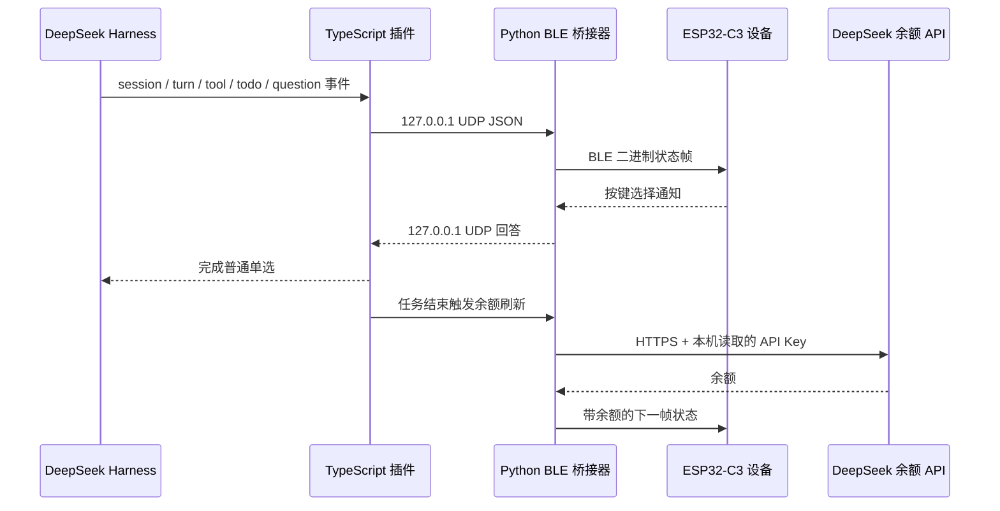

# 架构说明

## 数据流

## 组件职责

### Harness 插件

- 订阅全局 Harness 事件并归一化为有限状态。
- 获取任务标题、计时、Todo 和工具分类。
- 在任务结束或停止时触发余额刷新节奏。
- 拦截可安全简化的普通单选，并同时等待电脑或设备回答。
- 自动启动桥接器，提供 `/whale` 连接诊断命令。

### BLE 桥接器

- UDP 仅绑定 `127.0.0.1:8765/8766`。
- 自动扫描并连接 `HARNESS-WHALE`。
- 将 JSON 状态打包成版本化二进制协议。
- 直接请求 DeepSeek 余额，API Key 不经过插件、UDP 或 BLE。
- 把设备选择结果回送插件。

### 固件

- 从 BLE GATT 接收状态帧和问题帧。
- 维护标题、计时、Todo、余额与最终状态保持。
- 驱动鲸鱼娘状态动效、中文 UI 和循环滚动金额。
- 使用三个 ADC 按键完成单选导航和提交。

## 隐私边界

设备需要的是“状态”，不是任务内容。协议不包含 Prompt、回答、文件路径、工具参数、命令输出或 API Key。标题是唯一可能由用户命名的文本字段，发送前会截断并替换固件字库不支持的字符。

## 为什么源码还有其他模块

固件来自已经验证过的开发板工程，显示、电源、按键、BLE、分区和资源打包之间存在构建依赖。为了让公开代码能够复现当前二进制，没有贸然删除 legacy 组件。`board_config.h` 中的 `PRODUCT_HARNESS_ONLY=1` 以及 `app.c` 的 Harness-only 分支保证设备运行时只进入本 Demo。
